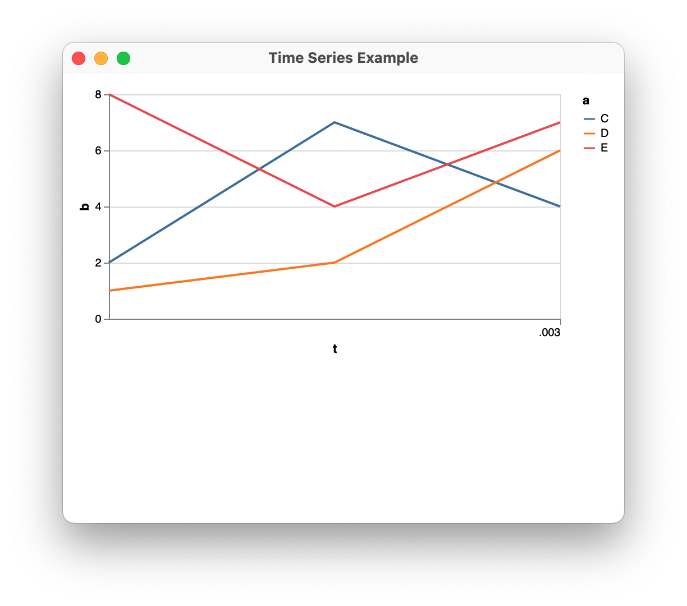
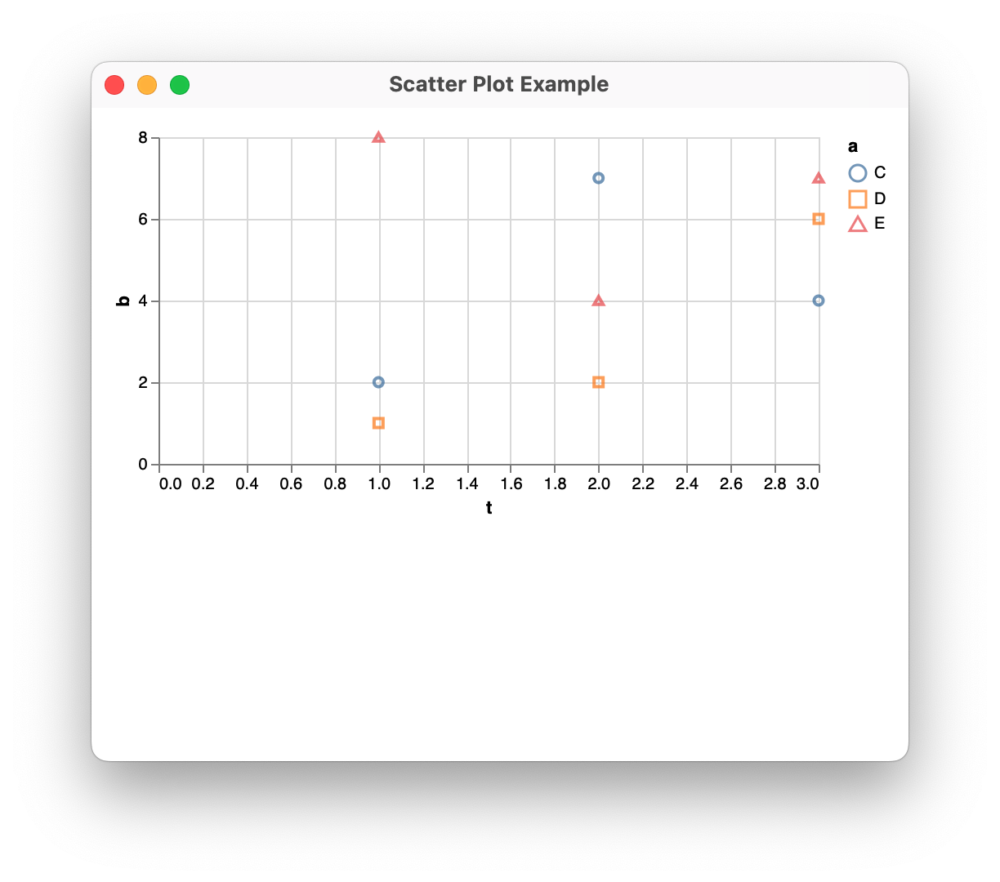

# vega view

Display [nushell](https://www.nushell.sh) tables using [Vega Lite](https://vega.github.io/vega-lite/) in a webview.

## Build

This is a rust project so [rust up](https://rustup.rs)! The supporting scripts require nushell, [install here](https://www.nushell.sh/#get-nu). Next, download the Vega prerequisites:

```
nu download-vega.nu
```

The executable, `vega-view`, can now be built:

```
cargo build --release
```

To run `vega-view` a webview component must be present.  You probably already have one as part of your platform but check the [platform specific notes for the wry project](https://github.com/tauri-apps/wry?tab=readme-ov-file#platform-specific-notes).  (This project uses wry.) 

## Usage

First run `nu` then: 

```nushell
use vega.nu                   # load the vega nushell module.                    
vega view <spec>              # visualize the input with a vega-lite specification
vega bar <value>              # a specification for a bar graph
vega series <value> <time>    # a specification for a time series plot
vega scatter <value> <domain> # a specification for a scatter plot
vega flip                     # exchange the x and y axes of a specification
```

For example, the following nushell script will visualize the `b` column of the table in `example.json`:

```nushell
use vega.nu
let spec = vega bar b
let data = open example.json
$data | vega view $spec
```

This produces a single bar with height representing the sum of the `b` column in the data.  A more interesting bar graph would divide the data up into categories. Identifying the category fields and putting it as a one-liner:

```nushell
open example.json | vega view (vega bar b --category=t --subcategory=a)
```

With nushell's excellent data handling abilities you can equally easily visualize CSV, SQLite, JSON and other data sources.  You can write your own specification or use one of the built in ones below.  

## Bar Graph

A vega-lite specification for a bar graph.


Usage:
```
  > bar {flags} <value> 
```
Flags:
```
  --category <String> - field to discriminate different bars
  --subcategory <String> - field to discriminate stacked bar sections
  --aggregate <String> - how to combine values for a bar or bar section (default: 'sum')
```
Parameters:
```
  value <string>: field name for the bar height
```

Example:

```nushell
open example.json | vega view --title "Stacked Bar Example" (vega bar b --category=t --subcategory=a)
```

## Time Series Plot

A vega-lite specification for a time series plot.



Usage:
```
  > series {flags} <value> <time> 
```

Flags:
```
  --category <String> - field to discriminate different series
  --area - render as a stacked area plot
```

Parameters:
```
  value <string>: field name for the series values
  time <string>: field for time values
```

Example:
```nushell
open example.json | vega view --title "Time Series Example" (vega series b t --category a)
```

## Scatter Plot

A vega-lite specification for a scatter plot.



Usage:
```
  > scatter {flags} <value> <domain> 
```

Flags:
```
  --category <String> - field for the category of the point in the plot
```

Parameters:
```
  value <string>: field name for the y coodinate of a point in the  plot
  domain <string>: field for the x coodinate of a point in the plot
```

Example:

```nushell
open example.json | vega view --title "Scatter Plot Example" (vega scatter b t --category a)
```

## Writing a Specification

The [vega-lite gallery](https://vega.github.io/vega-lite/examples/)  is a good place to start when developing a visualization.  You can adapt one of these specifications by changing the field names to match your data.  You can omit the `data` section of the specification.

## View Options

The `vega view` nushell command takes several options controlling how it displaya a Vega visualization of the input data in a window. (We have seen the `--title` option in the examples above.)

Usage:
```
  > view {flags} <spec> 
```

Flags:
```
  --title <String> - title for the window (default: 'Vega View')
  --width <Number> - width of the window (default: 1000)
  --height <Number> - height of the window (default: 800)
  -h, --help - Display the help message for this command
```

Parameters:
```  
spec <record>: a vega-lite specification
```

## The `vega-view`  Executable

The `vega-view` executable creates and controls the webview.   The `vega view` nushell command wraps the executable and takes care of conversions from nushell tables.  The wrapper locates the executable via the environment variable `$env.vega_view_bin`.  

It is possible to use `vega-view` directly without the nushell scripting.  By default JSON data is supplied on the standard input and a JSON vega-lite specification is given as an argument. Ensure that the data url in the specification is `/data`.  ie:


```
{
  ...
  data: { url: '/data' }, 
  ...  
}
```

The full command is:

```
Usage: vega-view [OPTIONS] <SPEC>

Arguments:
  <SPEC>  vega-lite specification for this visualization

Options:
      --page <PAGE>      file containing a HTML template for the page
      --script <SCRIPT>  file containing javascript used in the page
      --data <DATA>      file containing data to visualize (default is stdin)
      --title <TITLE>    The window title
      --width <WIDTH>    The window width
      --height <HEIGHT>  The window height
  -h, --help             Print help
  ```

  # LICENSE

 Material derived from the Vega project including vega-all.js is Copyright (c) 2024, University of Washington Interactive Data Lab.  See VEGA-LICENSE.

 All other material is Copyright (c) 2024 Cuprous Pty Ltd Australia.  See LICENSE.


